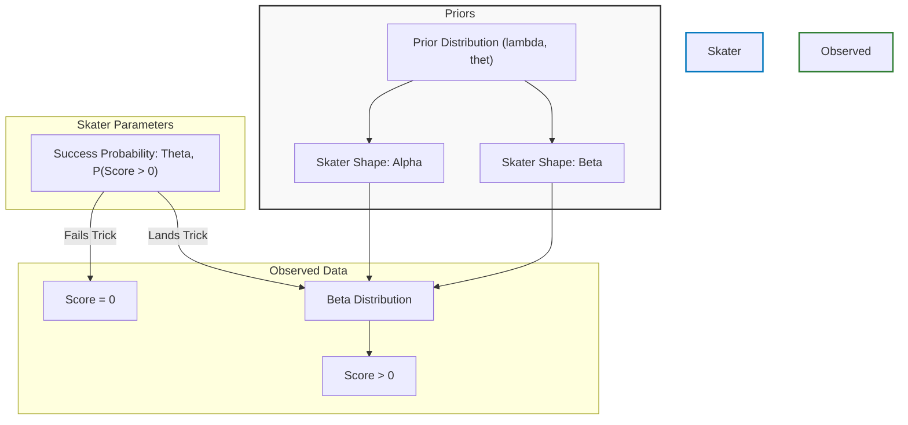

# Hierarchical Skate Modeling 🛹

## Project Overview
This project applies statistical learning techniques to model scoring in Street League Skateboarding (SLS). Using hierarchical modeling and Markov Chain Monte Carlo (MCMC) methods, it estimates skater-specific parameters to analyze the probability distributions of their scores on runs and tricks. 

By modeling both the probability of landing a trick and the quality of the trick when landed, we can better understand consistency and peak performance among professional skateboarders.

## The Model Architecture

The analysis is driven by a hierarchical Bayesian model. The score generation process is modeled in two steps:
1. **Success Probability ($\theta$)**: The probability that a skater lands a trick (scoring > 0).
2. **Score Distribution ($\alpha, \beta$)**: If the trick is landed, the score follows a Beta distribution parameterized by $\alpha$ and $\beta$.



## Repository Structure
The project has been organized for reproducibility and clarity:

- **`data/`**: Contains the raw and processed datasets (e.g., `SLS22.csv`).
- **`notebooks/`**: Jupyter notebooks containing exploratory data analysis, visualizations, and summary findings (e.g., `kod_report.ipynb`).
- **`scripts/`**: Python scripts implementing the Metropolis-Hastings MCMC algorithm and performance simulations (`metro.py`, `simulate.py`).
- **`results/`**: Output files from the MCMC sampling containing parameter trace results.
- **`reports/`**: Final write-ups and PDF reports detailing the findings (`findings.pdf`).
- **`archive/`**: Scratchpads and earlier code iterations.

## Methodology
The core analysis involves Bayesian inference via the Metropolis-Hastings algorithm:
1. **Formulation**: Building a hierarchical structure for skater scores, accounting for the zero-inflated nature of skateboarding data (many 0s for bailed tricks).
2. **Sampling**: Sampling from the posterior distributions to estimate parameters such as $\theta_i$ (trick landing rate), and $\alpha_i$, $\beta_i$ (score quality parameters for skater $i$).
3. **Simulation**: Simulating 50 competition runs based on the posterior distributions to evaluate the models predictive power against real-world SLS competitions.

## Model Performance & Key Findings
The project implemented and evaluated three distinct models (Frequentist, standard Bayesian, and Hierarchical Bayesian). We ran Monte Carlo simulations using the estimated parameters to predict the top finalists.

**Key Metrics & Results:**
- **Leave-One-Competition-Out Cross-Validation (LOCO):** To prove the model doesn't overfit, we backtested it by holding out entire competitions. The model achieved an **Overall Mean Absolute Error (MAE) of 0.561** (on a normalized 3.0 scale). This means it can predict a skater's total score in a completely unseen event within a ~5.6% margin of error.
- **Prediction Accuracy**: The models correctly predicted **1-2 of the top finalists** (specifically capturing Eaton and Hoban's real-world success). 
- **Hierarchical Smoothing**: The Hierarchical Bayesian model showed tighter variance for skaters with less data, pulling extreme individual estimates toward the global mean. 
- **Expected Total Scores**: The final simulations identified clear leaders in expected performance. For example, under the Hierarchical model, the top predicted skaters and their expected total score (mean $\pm$ std) were:
  - **Eaton**: $2.22 \pm 0.15$
  - **Jordan**: $2.06 \pm 0.39$
  - **Shirai**: $2.02 \pm 0.43$
  - **Hoban**: $1.97 \pm 0.40$
- **Strategy Insight**: Skaters with high consistency ($\theta_i$) heavily out-indexed those with higher peak score potential but lower landing probabilities.

## Tools Used
- **Python**: Core logic and MCMC scripting.
- **Pandas/NumPy**: Data manipulation, Method of Moments estimation, and numerical operations.
- **Matplotlib/Seaborn**: Visualizing posterior distributions and MCMC chains.
- **Jupyter/SciPy**: Interactive analysis and probability distributions.

## How to Run
1. Install requirements:
   ```bash
   pip install -r requirements.txt
   ```
2. Explore the results interactively in `notebooks/kod_report.ipynb`.
3. Re-run simulations or MCMC sampling via the files in the `scripts/` directory.