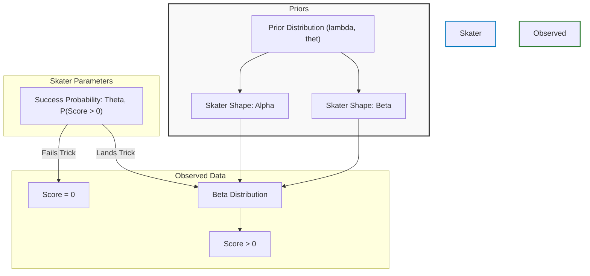

# Hierarchical Skate Modeling 🛹

## Project Overview
This project applies statistical learning techniques to model scoring in Street League Skateboarding (SLS). Using hierarchical modeling and Markov Chain Monte Carlo (MCMC) methods, it estimates skater-specific parameters to analyze the probability distributions of their scores on runs and tricks. 

By modeling both the probability of landing a trick and the quality of the trick when landed, we can better understand consistency and peak performance among professional skateboarders.

## The Model Architecture

The analysis is driven by a hierarchical Bayesian model. The score generation process is modeled in two steps:
1. **Success Probability ($\theta$)**: The probability that a skater lands a trick (scoring > 0).
2. **Score Distribution ($\alpha, \beta$)**: If the trick is landed, the score follows a Beta distribution parameterized by $\alpha$ and $\beta$.



## Repository Structure
The project has been organized for reproducibility and clarity:

- **`data/`**: Contains the raw and processed datasets (e.g., `SLS22.csv`).
- **`notebooks/`**: Jupyter notebooks containing exploratory data analysis, visualizations, and summary findings (e.g., `kod_report.ipynb`).
- **`scripts/`**: Python scripts implementing the Metropolis-Hastings MCMC algorithm and performance simulations (`metro.py`, `simulate.py`).
- **`results/`**: Output files from the MCMC sampling containing parameter trace results.
- **`reports/`**: Final write-ups and PDF reports detailing the findings (`findings.pdf`).
- **`archive/`**: Scratchpads and earlier code iterations.

## Methodology
The core analysis involves Bayesian inference via the Metropolis-Hastings algorithm:
1. **Formulation**: Building a hierarchical structure for skater scores, accounting for the zero-inflated nature of skateboarding data (many 0s for bailed tricks).
2. **Sampling**: Sampling from the posterior distributions to estimate parameters such as $\theta$, $\alpha_i$, and $\beta_i$ (individual skater effects) using Python.
3. **Simulation**: Simulating skater performance to evaluate the model's predictive power against real-world SLS competitions.

## Tools Used
- **Python**: Core logic and MCMC scripting.
- **Pandas/NumPy**: Data manipulation, Method of Moments estimation, and numerical operations.
- **Matplotlib/Seaborn**: Visualizing posterior distributions and MCMC chains.
- **Jupyter/SciPy**: Interactive analysis and probability distributions.

## How to Run
1. Install requirements:
   ```bash
   pip install -r requirements.txt
   ```
2. Explore the results interactively in `notebooks/kod_report.ipynb`.
3. Re-run simulations or MCMC sampling via the files in the `scripts/` directory.